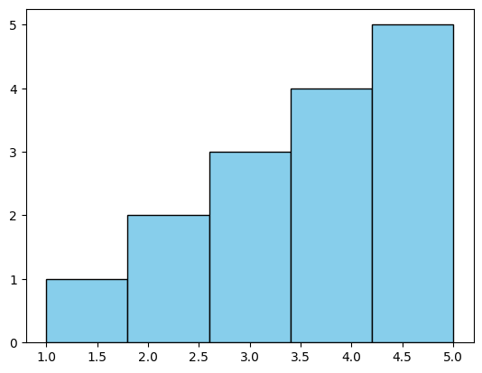
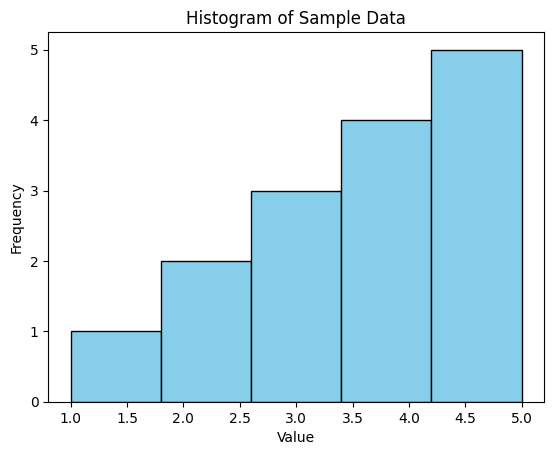
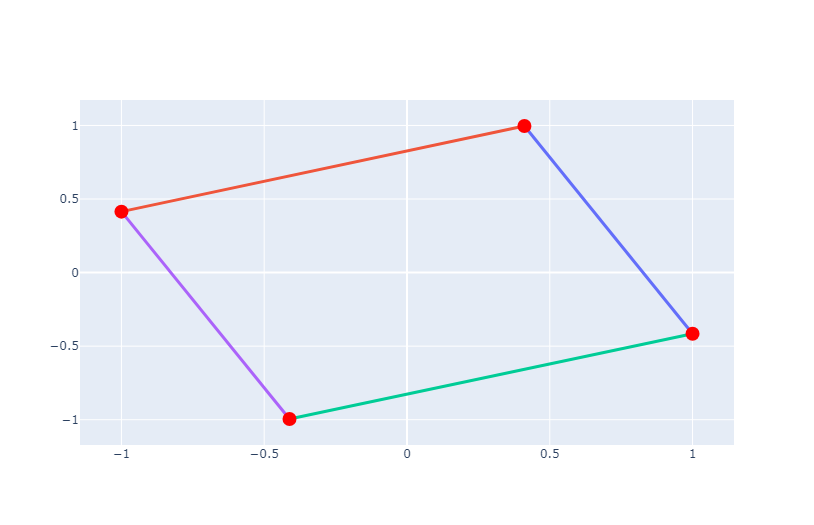
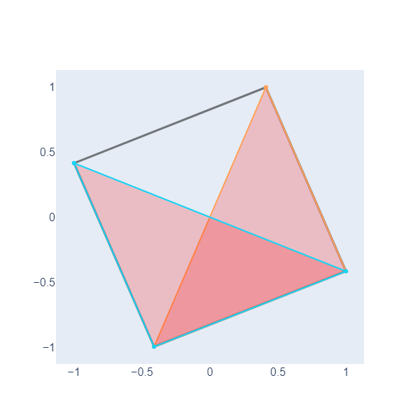

Python has several libraries that plot and visualize data.
[NetworkX](https://networkx.org/) is a library for working with graph data structures and algorithms, 
[Plotly](https://plotly.com/) is a library for creating interactive and publication-quality plots, and 
[Matplotlib](https://matplotlib.org/) 
is a comprehensive plotting library for creating static and interactive visualizations in Python. 
Each of these libraries serves different purposes and can be used for various data visualization 
tasks depending on the requirements and preferences of the user.

## Plot with matplotlib

First, we import the matplotlib.pyplot module, which provides a MATLAB-like plotting interface.
~~~
import matplotlib.pyplot as plt
~~~
{: .language-python}

Now, we defined some sample data for which we wanted to create a histogram.
~~~
data = [1, 2, 2, 3, 3, 3, 4, 4, 4, 4, 5, 5, 5, 5, 5]
print(data)
~~~
{: .language-python}
~~~
[1, 2, 2, 3, 3, 3, 4, 4, 4, 4, 5, 5, 5, 5, 5]

~~~
{: .output}

We use the plt.hist() function to create the histogram. We pass the data as the first argument, 
specify the number of bins using the bins parameter, and optionally specify the color of the bars
and their edges using the color and edgecolor parameters, respectively.
~~~
plt.hist(data, bins=5, color='skyblue', edgecolor='black')
~~~

{: .language-python}
~~~
(array([1., 2., 3., 4., 5.]),
 array([1. , 1.8, 2.6, 3.4, 4.2, 5. ]),
 <BarContainer object of 5 artists>)
~~~
{: .output}

 

We add labels to the x-axis and y-axis using plt.xlabel() and plt.ylabel(), and we
add a title to the plot using plt.title().
~~~
plt.xlabel('Value')
plt.ylabel('Frequency')
plt.title('Histogram of Sample Data')
plt.hist(data, bins=5, color='skyblue', edgecolor='black')
~~~
{: .language-python}

~~~
(array([1., 2., 3., 4., 5.]),
 array([1. , 1.8, 2.6, 3.4, 4.2, 5. ]),
 <BarContainer object of 5 artists>)
~~~
{: .output}
 

Notice that if you are not in colab or Jupyter notebook, but in stand-alone Python
you will need plt.show() to display the plot.
~~~
plt.show()
~~~
{: .language-python}

In this example, we produced a simple histogram of the sample data with five bins, 
with each bin representing the frequency of values falling within its range. 
The bars were colored sky blue with black edges for better visibility.

> ## Exercise 1: The nucleotides frequency of a DNA sequence
> Consider the DNA sequence stored in the string dna_sequence.
>  dna_sequence = "ATGCTGACCTGAAGCTAAGCTAGGCT"  
>
>       nucleotide_counts = calculate_nucleotide_frequency(dna_sequence)
>       nucleotides = list(nucleotide_counts.keys())
>       frequencies = list(nucleotide_counts.values())
> 
> > ## Solution
> > ~~~
> > 
> > 
> >    nucleotides = list(nucleotide_counts.keys())
> >    frequencies = list(nucleotide_counts.values())
> >
> >    plt.xlabel('Nucleotide')
> >    plt.ylabel('Frequency')
> >    plt.title('Nucleotide Frequency Histogram')
> >    plt.bar(nucleotides, frequencies, color='skyblue')
> > ~~~
> > {: .language-python}
> {: .solution}
{: .challenge}

## Creating graphs with NetworkX and Plotly 
Let's create a simple graph with NetworkX and visualize it using Plotly. 
In this example, we'll create a graph with four nodes and four edges.
Nodes are represented as red markers, and edges are represented as black lines.

~~~
import networkx as nx
import plotly.graph_objects as go
~~~
{: .language-python}

We create a simple undirected graph G.
~~~
# Create a simple graph
G = nx.Graph()
G.add_edges_from([(1, 2), (2, 3), (3, 4), (4, 1)])
~~~
{: .language-python}

We define positions for nodes using a spring layout 
algorithm (spring_layout). This assigns positions to nodes 
in such a way that minimizes the forces between them, 
resulting in a visually appealing layout. 

When you call nx.spring_layout(G) without specifying any 
arguments, the layout is generated randomly each time the 
function is called. However, if you want to ensure that you get 
the same layout each time you generate it, you can 
set a seed for the random number generator.
~~~
# Define positions for nodes
# Set a seed for the random number generator
seed_value = 42  # Choose any integer value as the seed
pos = nx.spring_layout(G, seed=seed_value)
pos
~~~
{: .language-python}

~~~
{1: array([0.4112362 , 0.99648922]),
 2: array([ 1.        , -0.41570474]),
 3: array([-0.41137359, -0.99514183]),
 4: array([-0.99986261,  0.41435735])}
~~~
{: .output}

Try removing or changing the seed_value; what do you observe?

We create traces for edges and nodes. Each edge is represented 
by a line connecting the positions of its 
two endpoints, and each node is represented by a marker at its position.
~~~
# Create edge traces
edge_traces = []
for edge in G.edges():
    x0, y0 = pos[edge[0]]
    x1, y1 = pos[edge[1]]
    edge_trace = go.Scatter(x=[x0, x1], y=[y0, y1], mode='lines', line=dict(width=3))
    edge_traces.append(edge_trace)

edge_traces
~~~
{: .language-python}

~~~
[Scatter({
     'line': {'width': 3},
      'mode': 'lines',
      'x': [0.4112362006825586, 1.0],
      'y': [0.9964892191512681, -0.41570474278971886]
 }),
 Scatter({
     'line': {'width': 3},
     'mode': 'lines',
     'x': [0.4112362006825586, -0.9998626088117056],
     'y': [0.9964892191512681, 0.41435735265600393]
 }),
 Scatter({
     'line': {'width': 3},
     'mode': 'lines',
     'x': [1.0, -0.4113735918708533],
     'y': [-0.41570474278971886, -0.9951418290175523]
 }),
 Scatter({
     'line': {'width': 3},
     'mode': 'lines',
     'x': [-0.4113735918708533, -0.9998626088117056],
     'y': [-0.9951418290175523, 0.41435735265600393]
 })]
Productos pagados de Colab - Cancela los contratos aquí

~~~
{: .output}

We create a Plotly figure with the specified data and layout. 
We disable the legend for simplicity.
~~~
node_x = []
node_y = []
for node in G.nodes():
    x, y = pos[node]
    node_x.append(x)
    node_y.append(y)

node_trace = go.Scatter(x=node_x, y=node_y, mode='markers', marker=dict(size=14, color='rgb(255,0,0)'))

print("node_x",node_x)
print("node_y",node_y)
~~~
{: .language-python}

~~~
node_x [0.4112362006825586, 1.0, -0.4113735918708533, -0.9998626088117056]
node_y [0.9964892191512681, -0.41570474278971886, -0.9951418290175523, 0.41435735265600393]
~~~
{: .output}

Let's create the Plotly figure and show it using Plotly's show() method.
~~~
fig = go.Figure(data=edge_traces + [node_trace], layout=go.Layout(showlegend=False))
fig.show()
~~~
{: .language-python}

 

~~~
# Define some triangles (example)
triangles = [(1, 2, 3), (4, 3, 2)]
~~~
{: .language-python}

~~~
# Node trace
node_trace = go.Scatter(x=[], y=[], mode='markers+text', hoverinfo='text', marker=dict(size=14), text=['Node 1', 'Node 2', 'Node 3'], textposition='top center', textfont=dict(size=14))
~~~
{: .language-python}

~~~
# Edge traces
edge_traces = []
for edge in G.edges():
    x0, y0 = pos[edge[0]]
    x1, y1 = pos[edge[1]]
    edge_trace = go.Scatter(x=[x0, x1, None], y=[y0, y1, None], mode='lines', line=dict(width=3, color='rgba(0,0,0,0.5)'))
    edge_traces.append(edge_trace)
~~~
{: .language-python}

~~~
# Triangle traces
triangle_traces = []
for triangle in triangles:
    x = [pos[vertex][0] for vertex in triangle]
    y = [pos[vertex][1] for vertex in triangle]
    triangle_trace = go.Scatter(x=x + [x[0]], y=y + [y[0]], fill='toself', mode='lines+markers', line=dict(width=2), fillcolor='rgba(255,0,0,0.2)')
    triangle_traces.append(triangle_trace)
~~~
{: .language-python}

~~~
# Configure the layout of the plot
layout = go.Layout(showlegend=False, hovermode='closest', xaxis=dict(showgrid=False, zeroline=False, tickfont=dict(size=16, family='Arial, sans-serif')), yaxis=dict(showgrid=False, zeroline=False, tickfont=dict(size=16, family='Arial, sans-serif')))
~~~
{: .language-python}

~~~
# Create the figure
fig = go.Figure(data=edge_traces + triangle_traces + [node_trace], layout=layout)
~~~
{: .language-python}

~~~
# Set the figure size
plot_size = 1
dpi = 600
fig.update_layout(width=plot_size * dpi, height=plot_size * dpi)
~~~
{: .language-python}

~~~
fig.show() # Show the figure
~~~
{: .language-python}

     

> ## Exercise 2: 
>
>  
> > ## Solution
> >
> > 
> {: .solution}
{: .challenge}

~~~
def visualize_simplicial_complex(simplex_tree, filtration_value, vertex_names=None, save_filename=None, plot_size=1, dpi=600, pos=None):
    G = nx.Graph()
    triangles = []  # List to store triangles (3-nodes simplices)
    
    for simplex, filt in simplex_tree.get_filtration():
        if filt <= filtration_value:
            if len(simplex) == 2:
                G.add_edge(simplex[0], simplex[1])
            elif len(simplex) == 1:
                G.add_node(simplex[0])
            elif len(simplex) == 3:
                triangles.append(simplex)
    
    # Calculate node positions if not provided
    if pos is None:
        pos = nx.spring_layout(G)
    
    # Node trace
    x_values, y_values = zip(*[pos[node] for node in G.nodes()])
    node_labels = [vertex_names[node] if vertex_names else str(node) for node in G.nodes()]
    node_trace = go.Scatter(x=x_values, y=y_values, mode='markers+text', hoverinfo='text', marker=dict(size=14), text=node_labels, textposition='top center', textfont=dict(size=14))
    
    # Edge traces
    edge_traces = []
    for edge in G.edges():
        x0, y0 = pos[edge[0]]
        x1, y1 = pos[edge[1]]
        edge_trace = go.Scatter(x=[x0, x1, None], y=[y0, y1, None], mode='lines', line=dict(width=3, color='rgba(0,0,0,0.5)'))
        edge_traces.append(edge_trace)
    
    # Triangle traces
    triangle_traces = []
    for triangle in triangles:
        x0, y0 = pos[triangle[0]]
        x1, y1 = pos[triangle[1]]
        x2, y2 = pos[triangle[2]]
        triangle_trace = go.Scatter(x=[x0, x1, x2, x0, None], y=[y0, y1, y2, y0, None], fill='toself', mode='lines+markers', line=dict(width=2), fillcolor='rgba(255,0,0,0.2)')
        triangle_traces.append(triangle_trace)
    
    # Configure the layout of the plot
    layout = go.Layout(showlegend=False, hovermode='closest', xaxis=dict(showgrid=False, zeroline=False, tickfont=dict(size=16, family='Arial, sans-serif')), yaxis=dict(showgrid=False, zeroline=False, tickfont=dict(size=16, family='Arial, sans-serif')))
    
    fig = go.Figure(data=edge_traces + triangle_traces + [node_trace], layout=layout)
    
    # Set the figure size
    fig.update_layout(width=plot_size * dpi, height=plot_size * dpi)
    
    # Save the figure if a filename is provided
    if save_filename:
        pio.write_image(fig, save_filename, width=plot_size * dpi, height=plot_size * dpi, scale=1)
    
    # Show the figure
    fig.show()

    return G
~~~
{: .language-python}

